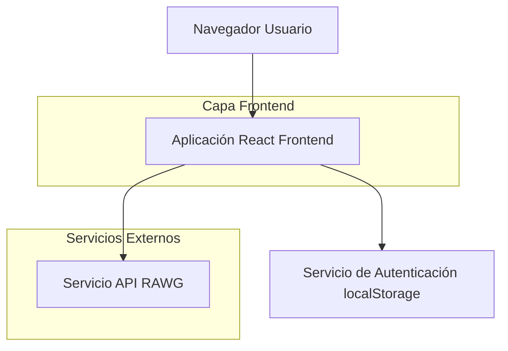

## 1. Diseño de Arquitectura



## 2. Descripción de Tecnologías

* Frontend: React\@18 + CSS Grid + Material-UI\@5 + Vite

* Herramienta de Inicialización: vite-init

* Backend: Ninguno (arquitectura frontend-only)

* API Externa: RAWG Video Games API

* Autenticación: localStorage (mock)

## 3. Definición de Rutas

| Ruta      | Propósito                                                   |
| --------- | ----------------------------------------------------------- |
| /login    | Pantalla de autenticación para usuarios existentes          |
| /register | Formulario de registro para nuevos usuarios                 |
| /home     | Página principal con catálogo de videojuegos por categorías |
| /         | Redirección a /login por defecto                            |

## 4. Definiciones de API

### 4.1 API de Autenticación (localStorage)

```typescript
// Tipos de autenticación
interface User {
  id: string;
  email: string;
  password: string;
}

interface AuthResponse {
  success: boolean;
  user?: User;
  error?: string;
}

// Funciones de autenticación
function login(email: string, password: string): AuthResponse
function register(email: string, password: string): AuthResponse
function logout(): void
function getCurrentUser(): User | null
```

### 4.2 API de Videojuegos (RAWG)

```typescript
// Tipos de videojuegos
interface Game {
  id: number;
  name: string;
  background_image: string;
  rating: number;
  genres: Genre[];
}

interface Genre {
  id: number;
  name: string;
}

interface GamesResponse {
  results: Game[];
  count: number;
  next: string | null;
  previous: string | null;
}

// Servicio de API
class GameService {
  getGamesByGenre(genre: string, page: number): Promise<GamesResponse>
  getGameDetails(id: number): Promise<Game>
  searchGames(query: string): Promise<GamesResponse>
}
```

## 5. Estructura del Proyecto

```
src/
├── components/
│   ├── common/
│   │   ├── LoadingSpinner.jsx
│   │   └── ErrorMessage.jsx
│   ├── auth/
│   │   ├── LoginForm.jsx
│   │   └── RegisterForm.jsx
│   ├── game/
│   │   ├── GameCard.jsx
│   │   ├── GameGrid.jsx
│   │   └── CategoryFilter.jsx
│   └── layout/
│       ├── Header.jsx
│       └── ProtectedRoute.jsx
├── pages/
│   ├── Login.jsx
│   ├── Register.jsx
│   └── Home.jsx
├── services/
│   ├── auth.service.js
│   ├── game.service.js
│   └── api.config.js
├── utils/
│   ├── validators.js
│   └── constants.js
├── hooks/
│   ├── useAuth.js
│   └── useGames.js
├── styles/
│   ├── globals.css
│   └── components/
└── App.jsx
```

## 6. Configuración de Variables de Entorno

```bash
# .env
VITE_RAWG_API_KEY=tu_clave_api_rawg
VITE_RAWG_BASE_URL=https://api.rawg.io/api
VITE_APP_NAME=VideoGames App
```

## 7. Gestión de Estado

* Estado de autenticación: Context API de React

* Estado de videojuegos: useState y useEffect hooks

* Estado de carga y errores: Estados locales por componente

* Persistencia de sesión: localStorage

## 8. Manejo de Errores

* Validación de formularios en cliente

* Manejo de errores de API con mensajes user-friendly

* Estados de carga durante fetch de datos

* Retry automático en caso de fallo de red

* Logs de errores en consola para debugging

## 9. Consideraciones de Seguridad

* Almacenamiento seguro de credenciales en localStorage

* Validación de rutas protegidas

* Sanitización de inputs en formularios

* Manejo seguro de API keys mediante variables de entorno

* HTTPS obligatorio en producción

