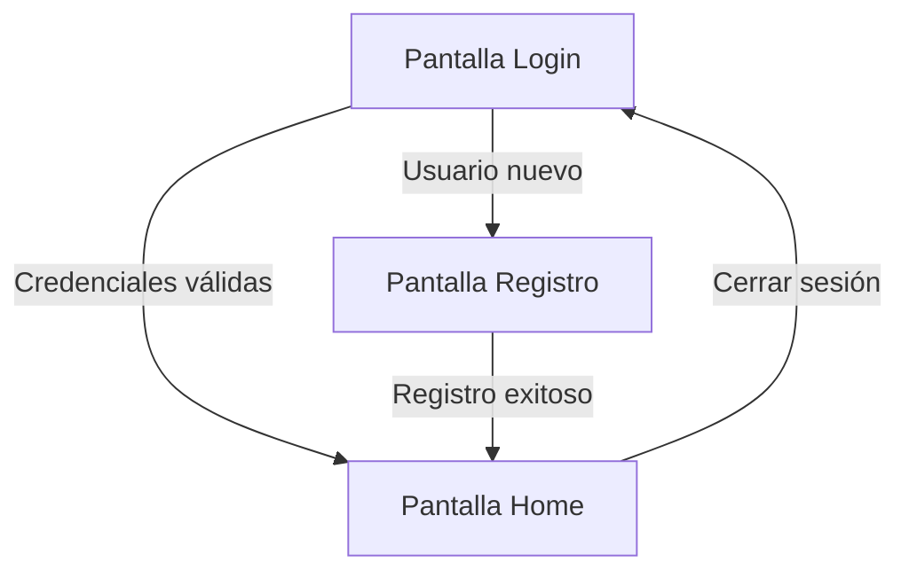

## 1. Descripción General del Producto

Aplicación web para explorar videojuegos por categorías con sistema de autenticación básico. Los usuarios pueden registrarse, iniciar sesión y navegar por un catálogo organizado por géneros con información detallada de cada juego.

- Problema que resuelve: Acceso centralizado a información de videojuegos organizada por categorías
- Usuarios objetivo: Jugadores y entusiastas de videojuegos que buscan descubrir nuevos títulos
- Valor del producto: Interfaz limpia y moderna para explorar videojuegos con autenticación personalizada

## 2. Funcionalidades Principales

### 2.1 Roles de Usuario
| Rol | Método de Registro | Permisos Principales |
|------|---------------------|------------------|
| Usuario Registrado | Formulario de registro con email | Acceso completo al catálogo de videojuegos |
| Usuario No Registrado | N/A | Solo puede ver pantallas de login/registro |

### 2.2 Módulos de Funcionalidades

Nuestra aplicación de videojuegos consta de las siguientes páginas principales:
1. **Pantalla de Login**: formulario de autenticación, enlace a registro
2. **Pantalla de Registro**: formulario de nuevo usuario, validación básica
3. **Pantalla Principal**: grid responsivo de categorías, tarjetas de videojuegos con imagen, título y rating

### 2.3 Detalles de Páginas
| Nombre de Página | Módulo | Descripción de Funcionalidad |
|-----------|-------------|---------------------|
| Login | Formulario de autenticación | Validar email y contraseña, mostrar errores, redirigir a home tras login exitoso |
| Login | Enlace a registro | Navegar a pantalla de registro para nuevos usuarios |
| Registro | Formulario de nuevo usuario | Capturar email, contraseña y confirmación, validar campos requeridos |
| Registro | Validación en tiempo real | Verificar formato de email y longitud de contraseña |
| Home | Grid de categorías | Mostrar videojuegos organizados por géneros (Acción, RPG, Shooter, Indie) |
| Home | Tarjeta de videojuego | Mostrar imagen del juego, título y rating con diseño responsivo |
| Home | Estado de carga | Indicador mientras se obtienen datos de la API |
| Home | Manejo de errores | Mensaje amigable si falla la carga de datos |

## 3. Flujo Principal del Proceso

El usuario accede a la aplicación y ve la pantalla de login. Si no tiene cuenta, puede navegar al registro. Tras autenticarse exitosamente, se redirige al home donde ve un grid de videojuegos organizados por categorías. Cada tarjeta muestra información básica del juego obtenida de la API RAWG.

## 4. Diseño de Interfaz de Usuario

### 4.1 Estilo de Diseño
- Colores primarios: Azul oscuro (#1976D2) y blanco
- Colores secundarios: Gris claro (#F5F5F5) y gris medio (#757575)
- Estilo de botones: Rectángulos redondeados con sombra sutil
- Tipografía: Roboto, tamaños 14px para texto normal, 16px para títulos pequeños, 24px para títulos principales
- Layout: Card-based con grid responsivo
- Iconos: Material Design Icons

### 4.2 Resumen de Diseño por Página
| Página | Módulo | Elementos de UI |
|-----------|-------------|-------------|
| Login | Formulario | Fondo blanco, inputs con bordes redondeados, botón principal azul, validación con mensajes en rojo |
| Registro | Formulario | Similar a login con campo adicional de confirmación de contraseña |
| Home | Grid de juegos | Tarjetas con imagen superior, título en negrita debajo, rating con estrellas, grid de 4 columnas en desktop, 2 en tablet, 1 en móvil |

### 4.3 Responsividad
Diseño desktop-first con adaptación progresiva. Breakpoints: 1200px (desktop), 768px (tablet), 480px (móvil). Grid adaptativo que ajusta número de columnas automáticamente.